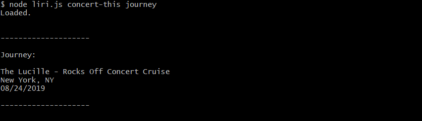
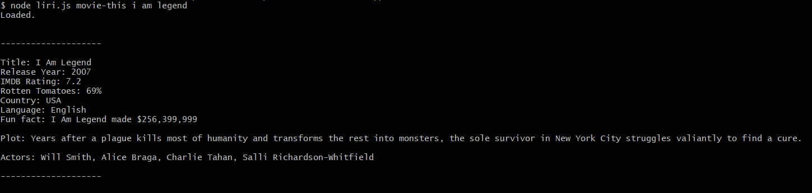
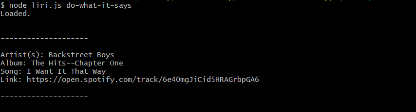

# liri-node-app
 ## This Node.js app takes user input and does different things based on several commands.
 #### It can find concerts(using the Bands In Town API).
 #### It can find songs(using the spotify search API). 
 #### It can also find movies(using the OMBD API). 
Search for concerts by band: 

Search Spotify for a song:

What happens if no song is specified:

Search for movies:

Using a txt file to search spotify for the song in the file:

